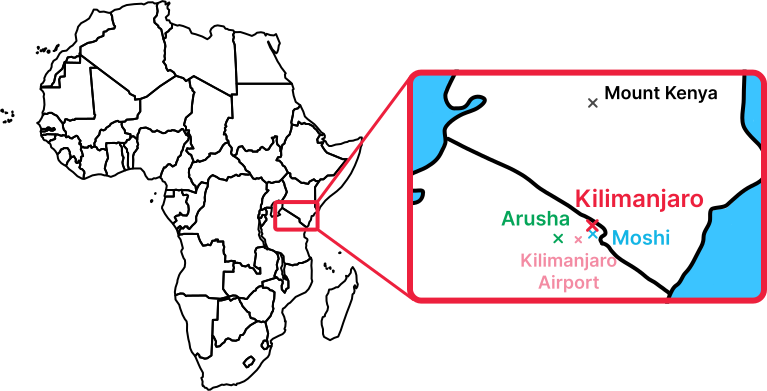
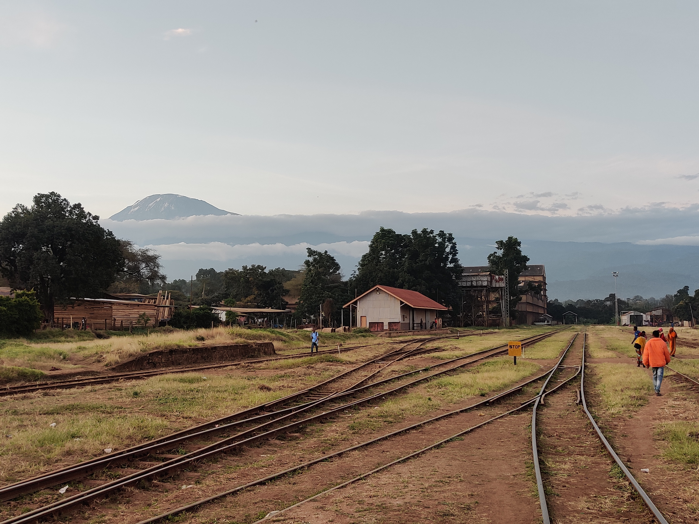
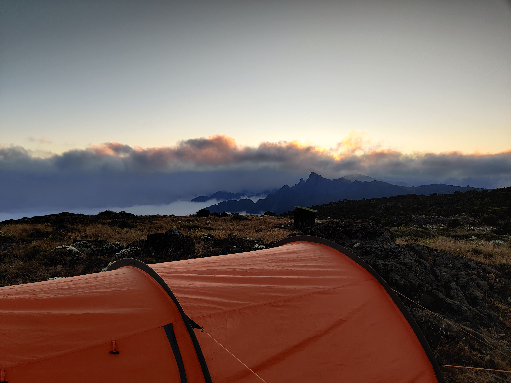

<blockquote class="prose-quoteless">
It's 6:33 AM, and I'm standing at the highest point in Africa – Kilimanjaro's summit, 5895 meters (19,340 feet) above sea level. The thermometer reads a chilly -15°C (5°F). After trudging upwards in the dark for over six hours, with just over three hours of sleep under my belt, you'd think I'd be exhausted. But no, there's this incredible surge of adrenaline and gratitude pumping through me. I made it. I'm here, at the top of Africa, and what a wild ride it's been!
</blockquote>

So, how did I get here? That's the story I want to share with you in this blog post. It’s a tale that spans from the initial spark of an idea to the planning, through a challenging 6-day ascent, and culminating in the lessons learned along the way. You're probably wondering, 'What does it really take to climb Kilimanjaro?' Stick with me through this story, and I’ll unfold that answer, piece by piece.

But first, let's set the stage with a bit about Mount Kilimanjaro itself.

### The mountain

Kilimanjaro isn't just any mountain – it's the tallest in Africa, standing proud at 5895 meters (19,340 feet). That's about 700 meters (2300 feet) taller than its nearest competitor, Mount Kenya. One of the reasons Kilimanjaro is so popular among beginner climbers is its accessibility. Unlike other high-altitude mountains, it's less technical and less dangerous, making it a favourite for those looking to experience high-altitude climbing without the extreme technical challenges.

The mountain is located in Tanzania, close to the border with Kenya. Most climbers start their journey in Moshi, a town situated at the base of Kilimanjaro, about 900 meters above sea level. Then there's Arusha, the larger city in the region with a population of over half a million. If you're flying in for the climb, you'll probably land at Kilimanjaro Airport, conveniently located between these two cities.

As for the mountain's structure: Kilimanjaro is made up of three volcanic cones - Kibo, Mawenzi, and Shira. Kibo is the highest point and the target for climbers. It's dormant, which means there's a slight chance it _could_ erupt again, but it's been quiet for a while. Mawenzi and Shira, on the other hand, are extinct.

So that's a quick overview of Kilimanjaro. Let's get into the heart of the climbing experience.

### Background

The seed for this adventure was planted in a pretty unexpected way: a dream. Yes, I literally dreamt about Kilimanjaro, a mountain whose name I'd heard but knew next to nothing about. Now, for someone who's never really climbed anything significant and isn't exactly a mountaineering enthusiast, this was out of left field. But that dream stuck with me.

At the time, life was throwing some tough punches. I was grappling with the loss of my mom, navigating the aftermath of a difficult breakup, and struggling to find motivation in my university studies. I was in a rut, needing something to break the monotony, something to drive me forward. That’s when the idea of climbing Kilimanjaro transformed from a mere dream into a potential goal.

The more I learned about the mountain, the more excited I became. It was the perfect challenge, a goal to work towards, an adventure to embark on. So I promised myself: I would climb Kilimanjaro after completing my bachelor's degree. It seemed like a far-off goal at the time, but about two years later, that dream started to become a reality. I found myself on a plane, bound for Tanzania, ready to embark on a journey that felt like it was meant to be.

### The Journey

I have to admit, when it came to mountain climbing, I was pretty much in the dark. I had no real idea what climbing a mountain like Kilimanjaro entailed, not to mention what it would be like to hike continuously for days. My physical preparation? Well, it was pretty much limited to a few runs here and there. The weeks leading up to my flight were crammed with work on my bachelor thesis, leaving little time for any serious physical preparation.

Now, this isn’t an excuse, but more of a window into my mindset at the time. I was, let's say, stubbornly optimistic. I kept telling myself and everyone else, 'Oh, I'll be fine,' or 'I'll just push through it like I always do.' This mix of naivety and confidence was my companion as I landed at the Kilimanjaro Airport.

The first order of business was meeting David, a tour guide recommended by friends and family. Traveling solo, I was keen on joining a group to share the climbing experience with. However, timing didn't work out for group inclusion, so I embarked on the tour solo. But 'solo' on the Kilimanjaro terms doesn't mean completely alone – you need a guide, a cook, and porters just to access the national park, which is honestly for the best. These folks are the unsung heroes of the mountain, handling everything from lugging essential gear to cooking meals and guiding you safely from camp to camp.

My team was fantastic – Lamar, my guide; Michael, the chef; and Anderson, Sponi, Fabian, Maneno, and Jona, the five porters. Meeting them at the hotel in Moshi, I knew I was in good hands.

Lamar briefed me on what to expect over the next six days. We also went through my gear to see what I had and what I still needed to rent. It turned out I still needed quite a bit more than I expected – about $140 USD worth of gear from a nearby rental shop.

| Equipment I brought                  | Equipment I rented                                                                       |
|--------------------------------------|------------------------------------------------------------------------------------------|
| large backpack (60L)                 | (winter) sleeping bag                                                                    |
| drinking bladder (3 Liter)           | sleeping mat                                                                             |
| walking sticks                       | a small backpack (I thought I would carry the big 60L backpack but that one was too big) |
| hiking boots                         | gloves (thin and thick)                                                                  |
| headlamp                             | summit pants (only for summit, against the cold/wind)                                    |
| clothing (for warm and cold weather) | summit jacket (only for summit, against the cold/wind)                                   |
| powerbank (20.000 mAh)               | balaclava (didn't use)                                                                   |
| winter hat                           |                                                                                          |
| fleece and jacket                    |                                                                                          |

Looking back, nearly every piece of equipment was essential, except for the balaclava which ended up being the one thing I didn’t use. Turns out, my winter hat and the hoods from my two jackets were more than enough to keep my head warm.

With all the equipment finally sorted, the crew efficiently packed up the rest – tents, food, and other necessities for our journey. Everything was set for an early start the next morning. So, I spent one last night in the comfort of a warm, cozy bed at the hotel, mentally preparing myself for the adventure that lay ahead.

#### Day 1 -  Embarking on the Machame Route Through the Rainforest

There are a few different paths you can take to conquer Kilimanjaro, and I chose the Machame Route, opting for the 6-day journey. The trip to the starting point felt a bit like riding in a dala dala – those local, often crowded minibuses. We arrived at the Machame gate, situated at 1800 meters (5905 feet), where I grabbed some lunch and waited my turn to pass through the checkpoint.

The first day was an exclusive trek through the rainforest. For about five hours, we ascended 1000 meters (3280 feet), surrounded by the lush beauty of the forest. It was a sensory overload – the air was alive with the sounds of wildlife, the vibrant colors of the foliage, and exotic plants like the elephant trunk flower that only grows at the Kilimanjaro. And let's not forget the oxygen-rich air, a luxury that, little did I know, I'd soon start to miss.

Thankfully, the hike on the first day wasn't too challenging. I kept a good pace and managed quite well. By the time I reached **Machame Camp** at 2835 meters (9301 feet), the porters had already set up the tents, and Michael, our chef, was preparing dinner. Sitting down for a hot meal in the awning after that long day of hiking was nothing short of amazing.

One thing to note is how early the sun sets around here – by 6 PM, it's dark. This took a bit of getting used to, but it also meant our days started and ended early. A rhythm of early nights and early mornings quickly became the norm.

#### Day 2 - Rising with the Sun and Scaling New Heights

I'm usually not an early riser, but something about this adventure made waking up to the sunrise an absolute delight. There's nothing quite like sipping on a warm cup of coffee after a good night's sleep in the great outdoors. Despite getting a solid eight hours, the night was pretty chilly, making me grateful for my warm sleeping bag.

Our second day of climbing started around 8 AM, post-breakfast and backpack-packing. We couldn't have asked for better weather – the sun was shining, and the sky stayed mostly clear throughout the day.

The landscape had transformed dramatically from the dense jungle of the previous day to a sprawling moorland. The trees were much shorter here. Lamar, my guide, had warned me that this day would be a bit more physically challenging, but the stunning views and dramatic scenery made it all worthwhile. The hike took us about six hours, and we ascended nearly another 1000 meters (3280 feet).

By the time we reached the camp (**Shira Cave Camp**), once again the tent was already set up, and lunch was in the works. I used my brief downtime to catch up with friends and family back home.

And here's something that blew my mind – having mobile internet connection in the middle of the mountain! And not just any connection – it was surprisingly good. I could easily keep in touch with my family, even from the last camp at 4600 meters (15091 feet). It's wild, especially considering back home in Germany, you can lose signal just stepping out of a city center (okay, it's not that bad, but still!).

We capped off the day with a short 30-minute climb to a scenic spot, perfect for capturing some panoramic shots. What an amazing day it was!

#### Day 3 - Rising to New Altitudes and Braving Nature's Extremes

The cold was more intense this night, easily dipping into negative degrees. The frost blanketing the tent was proof enough. Waking up before sunrise to answer nature's call in such freezing conditions was... let's just say, not fun. It took a real mental push to get out of the cozy confines of my sleeping bag.

Despite the chill, I slept soundly, bundled up in pants, a fleece, and a jacket inside my sleeping bag. Post-breakfast, we set off towards the Lava Tower, climbing up to 4600 meters (15091 feet). The plan was to have lunch there and then descend back to the **Baranco Camp** at 3900 meters (12795 feet). This 'climb high, sleep low' strategy helps the body acclimatise to the altitude – a crucial part of avoiding altitude sickness.

So far, I hadn’t experienced any real symptoms of high altitude, but as we reached the Lava Tower, I could feel my body reacting. At this height, the air contains just 11.8% oxygen – quite a drop from the 20.9% you get at sea level. The result? A growing, persistent headache and a notable loss of appetite. I forced myself to eat, knowing I needed the energy, but it wasn't pleasant.

Descending to Baranco Camp, my headache worsened with each step, which was worrying, considering we were still far from the peak's altitude. Lamar had warned me about this, saying it was common at this stage of the climb.

Once at the camp, my headache lingered, morphing into nausea. It was a rough couple of hours, battling the urge to vomit and laying as still as possible in my tent, hoping for relief. Thankfully, the nausea passed fairly quickly, and I felt much better, reassuring Lamar and myself that I was ready for the next day.

That feeling of relief lasted until the night when a ferocious storm hit. Its intensity was something else – the kind of storm that made you feel like the tent might just get swept away with you in it. I usually sleep through anything, but this storm had me waking up multiple times.

And then, there was the stomach pain. Sharp, growing pains that had me up at 3 AM, scrambling to get dressed for a frantic trip to the camp toilet. The toilets in these camps are essentially cabins with a hole in the ground – not the most pleasant of places. Imagine squatting over this hole, a toilet paper in one hand and a torch in the other, questioning your life choices. And, as luck would have it, I had to make that trip not once but twice that night.

#### Day 4 - The Longest Climb and the Eve of the Summit Push

Let's just say the night was far from ideal, but I've had worse. Thanks to some Imodium, the stomach troubles were mostly at bay. So, we kicked off early again, right after breakfast, gearing up for what would be our longest day yet – a solid 8-hour climb.

The Machame Route can be tackled in either 6 or 7 days. I went for the 6-day option, which meant skipping **Karanga Camp** on the fourth day and heading straight for the final camp.

And that’s exactly what we did. Starting at 3900 meters (12795 feet), we pushed on, climbing up to 4673 meters (15331 feet). By the afternoon, we had reached **Barafu Camp** – the last and highest camp. The day was long and exhausting, especially on the back of a sleep-deprived night. But surprisingly, the altitude didn’t hit me as hard this time. Maybe the acclimatisation was paying off – only a slight pressure in my head, but no headache, nausea, or other issues. A big relief!

The plan for the evening was simple: unwind, grab an early dinner, and try to catch some sleep before the midnight summit push. We aimed for at least three hours of rest before waking up at 11:30 PM.

As the evening crept in, so did my apprehensions. The mild pressure in my head escalated into a persistent throb. Thoughts about the upcoming climb swirled in my mind – the potential difficulty, the chance of symptoms flaring up again, and the big question: would I make it to the top? Trying to sleep felt like trying to silence a crowded, noisy room in my head. Eventually, though, I managed to drift off, squeezing in a little over three hours of sleep.

Anderson’s voice cut through the quiet of the night: "It's time." At 11:30 PM, I geared up, layering against the cold, and double-checked my essentials – snacks, water, medicine. Everything was in place. It was time for the final push, the moment of truth – the climb to the summit.

#### Day 5 (Ascent) - The Grueling Midnight Trek to the Summit

Midnight struck, and it was time to leave the tent. Stepping out into the pitch-dark night, my headlamp cut a narrow path of visibility, but beyond a few meters, darkness engulfed everything. In that vast blackness, a string of lights from other climbers' headlamps snaked up the mountain path – a surreal, goosebump-inducing sight.

From that moment, I was all in, despite not feeling my best. The little hours of sleep were taking their toll, and my headache had returned. I knew this climb wouldn't be like the previous days – those had been manageable and enjoyable. But Lamar had warned me: the next 6 to 9 hours would be a battle.

For this crucial part of the climb, it wasn't just Lamar and me. Sponi, the most experienced and eldest member of our team, joined us. His presence meant that if Lamar couldn't continue, I wouldn't be forced to turn back as well. Walking sandwiched between them, I felt a sense of security.

The rest of the team wished us luck, and our trio began the ascent.

Recalling the details of this climb is like trying to piece together a wild night out with the boys and 3 bottles of vodka – you remember the overall vibe, key moments, and how you felt, but the rest is a blur.

About two hours in, exhaustion hit me hard. The thought of enduring another six hours felt overwhelming. It wasn't just the physical climb, the biting cold, or the relentless wind – it was the altitude, the thinning air that made every step a Herculean effort.

With a pounding headache and rising nausea, the climb became as much a mental game as a physical one. Lamar's advice to not focus on the summit echoed in my mind. Instead, I concentrated on smaller goals – make it another 15 minutes, then a one-minute break. Left foot. Right foot. Just keep moving.

At around 5500 meters (18044 feet), the nausea won, and I vomited. Strangely, it was a relief. Lamar handed me some medicine, and with this minor respite, we continued our ascent. The sun was still at least 2 hours away from rising, and we were only about halfway through our journey to the summit.

As the climb progressed, exhaustion began to take its toll on me, and I started questioning my decision to undertake this journey. There were moments when I even felt angry at myself for coming up with such a 'brilliant' idea as to climb this mountain.

I'm not one to give up easily, but the thought of quitting crossed my mind more times than I care to admit. My steps were shaky, and several times, Sponi, trailing behind me, had to step in to keep me from stumbling.

Our pace felt slow, yet we were overtaking others on the path. Seeing their struggles was a small comfort – a reminder that I wasn't alone in this challenge.

Lamar, usually the quiet type, could see I was struggling and showered me with encouragement. His words, 'I know you can do this, you’re strong,' were like a lifeline, helping me push through the toughest moments.

The next hours were a blur, walking in a trance-like state, my eyes glued to the ground, focusing on each step. The fatigue was relentless, and the altitude symptoms were fierce. I found myself constantly asking how much further we had to go.

Finally, we reached Stella Point at 5756 meters (18884 feet). This is the last stretch before Uhuru Peak. We arrived just before sunrise, but the weather was turning – a stormy wind that cut through everything. It was so cold and turbulent that we didn’t even stop for a photo at Stella Point. I just wanted to keep moving.

The final part of the trek wasn’t steep, but even the gentle incline felt monumental. Sponi had to support me for the last hundred meters. Emotions overwhelmed me – relief, pride, a sense of achievement like I'd never felt before. I was close to realising the dream that had occupied my thoughts for so long. The exhaustion, the pain, all of it was about to pay off. I couldn't hold back some tears of joy that started rolling down my cheeks.

And then, there it was – the sign at Uhuru Peak, 5895 meters (19341 feet) above sea level. The culmination of a journey that had started with a dream.

#### Day 5 (Descent) - A Swift Return through Changing Landscapes

Having taken my triumphant photo at the summit sign, something inside me changed. It was as if reaching the top had flipped a switch, and I suddenly found myself filled with a surge of energy. Just 20 minutes earlier, I had been at my limit, but now, heading down, I felt like nothing could stop me.

The descent to Barafu Camp was surprisingly swift. The path, covered in sand and dirt, allowed us to slide down – it almost felt like skiing. I practically ran down the mountain, feeling as light as if I had wings, despite the exhaustion.

Once back at Barafu Camp, however, the tiredness hit me like a ton of bricks. Lamar advised against sleeping, cautioning that it might make me feel weaker, so I spent the time sitting in my chair, fighting to keep my eyes open. After an hour’s rest and repacking, we continued our descent to **Mweka Camp**, located at around 3100 meters (10170 feet). In total, we had descended nearly 3000 meters (9842 feet) since reaching the summit.

As we approached Mweka Camp, the landscape morphed back into dense jungle. It felt like I could see the oxygen particles floating in the air – breathing had never felt so good. The rich air worked wonders on my lingering headache, easing it for the first time in what felt like ages.

I told my team that I planned to sleep as soon as possible and would likely skip dinner. They kindly prepared a meal anyway, just in case I woke up hungry. But that night, sleep was all I craved and managed, without waking for food.

#### Day 6 - A Joyful Farewell and the Journey's End

After a blissful 14-hour sleep, I woke up feeling like a new person – rejuvenated and bursting with energy. It was a welcome change after the physical and mental exertions of the previous days. But before wrapping up this incredible journey with a final 3-hour trek to Mweka Gate, there was one important event left – the tipping ceremony.

This ceremony is more than just a formal goodbye. It's a vibrant celebration with the group, filled with dancing and singing, marking the success of our expedition. It's also the moment where clients show their gratitude to the team through tips. While it's not mandatory, tipping is highly recommended. These amazing people work tirelessly for your comfort and safety, often relying on tips as a significant part of their income. The usual amount varies between $5-$20 per day for each team member, depending on their role.

The atmosphere was jubilant during the ceremony. Handing over my tips, I felt a deep sense of gratitude for their hard work and support. Once the ceremony concluded, we gathered our belongings and began our final descent to the gate.

Upon arrival, I was handed a certificate – a tangible reminder of the journey, stating that I had reached the summit on August 10th at 6:33 AM.

And just like that, my 6-day adventure on Kilimanjaro came to a close. It was an experience that pushed me to my limits, taught me about resilience, and left me with memories that I'll cherish forever.

### Conclusion

Looking back at my six-day trek up Kilimanjaro, it's time to revisit the initial question: "What does it take to climb this mountain?" Reflecting on this, I realise that my answer is shaped by my unique experience, which may vary greatly from what another climber might encounter. Especially for seasoned climbers, the challenges I faced might seem a lot less daunting.

I speak from the perspective of a total novice in the world of high-altitude climbing – someone who had never tackled a mountain of this scale before, never embarked on a multi-day climb, and whose physical prep was limited to occasional runs.

Through this lens, I learned that climbing Kilimanjaro isn't just a physical endeavor. It's a complex mix of preparation, mental fortitude, teamwork, adaptability, respect for nature and culture, and an emotional rollercoaster.

1. **Preparation**: Success starts with proper preparation. Research extensively, understand what climbing the mountain involves, and determine whether to buy or rent equipment. Speak with those who've climbed before and assess your physical readiness.

2. **Mental Strength**: Prepare for moments of mental strain. The climb will test your mental resilience as much as your physical stamina. Confronting the unknown, battling altitude sickness, and pushing through exhaustion requires a robust mindset.

3. **Teamwork and Dependence**: You can't climb Kilimanjaro solo. Relying on guides, porters, and fellow climbers is crucial. Their experience and support are invaluable, teaching you trust and the strength of unity.

4. **Adaptability and Perseverance**: Be adaptable to changes in weather, altitude, and health. Perseverance in the face of adversity is key to reaching the summit.

5. **Respect for Nature and Culture**: The climb fosters a deep appreciation for nature's magnificence and the local Tanzanian culture. It's a chance to contribute to the local economy and understand the mountain's significance to the people.

6. **Emotional Journey**: Beyond physicality, this is an emotional odyssey. It involves confronting fears, battling doubts, experiencing exhilaration, and emerging more self-aware.

For me, the Kilimanjaro was more than just a climb; it was a profound journey of self-discovery and personal growth, a testament to the power of human resilience and determination.

Cheers!